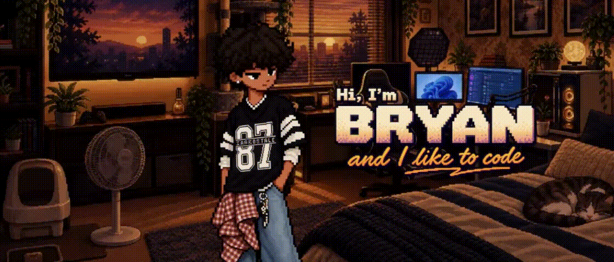

## Hi there 👋

<!--
**bryanCastle/bryanCastle** is a ✨ _special_ ✨ repository because its `README.md` (this file) appears on your GitHub profile.

Here are some ideas to get you started:

- 🔭 I’m currently working on ...
- 🌱 I’m currently learning ...
- 👯 I’m looking to collaborate on ...
- 🤔 I’m looking for help with ...
- 💬 Ask me about ...
- 📫 How to reach me: ...
- 😄 Pronouns: ...
- ⚡ Fun fact: ...
-->

  

<h1 align="center">Hi, I’m Bryan Castillo 👋</h1>

  Software engineer and photographer building creative tools, AI-powered applications, and polished digital experiences.

  <a href="mailto:bryan.castillogarcia@sjsu.edu">Email</a>
  ·
  <a href="https://github.com/bryanCastle">GitHub</a>

About Me

I enjoy turning ideas into practical products with clean interfaces and focused user experiences. My work ranges from native Windows software and interactive web applications to machine-learning experiments and AI tools for creators.

🔭 Building creative software and AI-powered experiences

🧠 Exploring machine learning, computer vision, and generative AI

📷 Combining software engineering with photography and visual design

🎨 Interested in thoughtful interfaces, animation, and product design

Featured Project

  <h3>
    <a href="https://github.com/bryanCastle/FistBatchWindows">
      FirstBatch
    </a>
  </h3>

  

    <strong>The simple way to sort a shoot.</strong>
  

  

    FirstBatch is a native Windows app that helps photographers quickly review and organize large photo shoots. It provides a focused, keyboard-friendly workflow with a distraction-free viewer, RAW image support, local file management, and reversible sorting actions.
  

  

    <strong>Built with:</strong> C# · .NET · WinUI 3 · Windows App SDK
  

  

    <a href="https://github.com/bryanCastle/FistBatchWindows">
      View the source code
    </a>
    ·
    <a href="https://apps.microsoft.com/detail/9PL9MVN51JQS">
      Get it from the Microsoft Store
    </a>
    ·
    <a href="https://firstbatch-rho.vercel.app/">
      Visit the product page
    </a>
  

Technologies

  

Current Focus

I’m currently focused on building software that combines engineering, visual design, and artificial intelligence—especially tools that make creative work faster and more enjoyable.

  <strong>Thanks for visiting.</strong>

